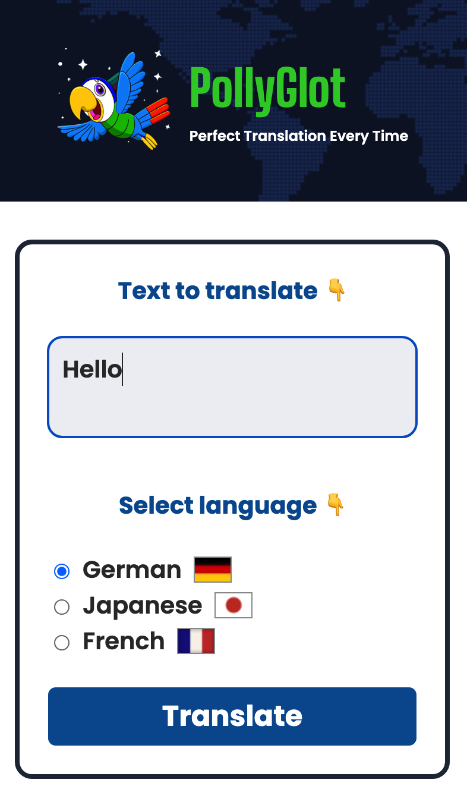
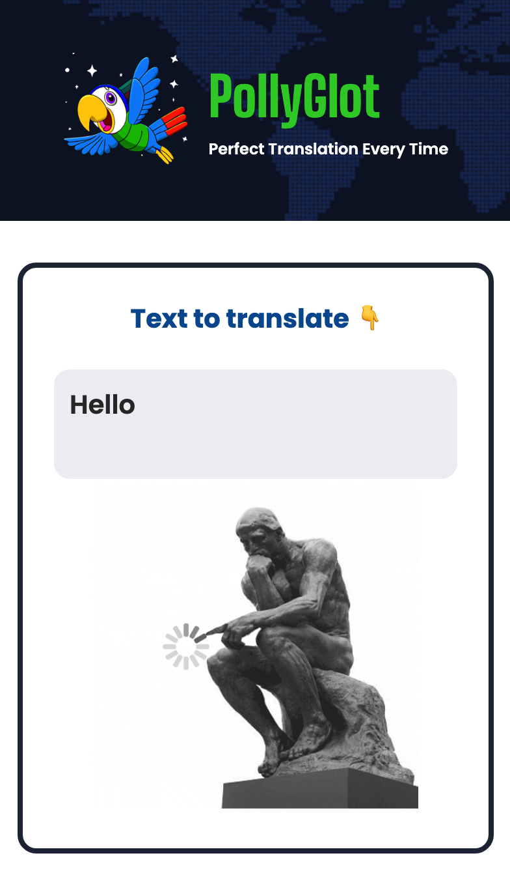
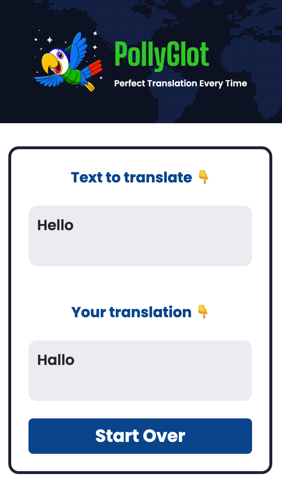

# PollyGlot!
An AI-powered poly-translator. The app is built with React and powered with OpenAI API.  

## In This Document:
1. [Live Application URL](#live-application-url)
2. [How to Use the Application](#how-to-use-the-application)
3. [Technologies Used](#technologies-used)
4. [Future Features](#future-features)
5. [Challenges and Learning Points](#challenges-and-learning-points)

## Live Application URL
https://pollyglot-shant.netlify.app/

## How to Use the Application
1. User enters text to translate.
2. User selects the language to translate to.
3. User clicks translate.
4. Translation should be displayed shortly.
5. User can start over.

## Technologies Used
1. HTML, CSS, and React.
2. [OpenAI API](https://platform.openai.com/).
3. Vite for building and packaging.

## Future Features:
1. Turn the app into a chat app.
2. Add the ability to correct text.
3. Add AI-generated images.

## Challenges and Learning Points:
1. Vite requires environment variables to be prefixed with `VITE_` and imported using `import.meta.env.VITE_API KEY`.
2. Use React's `useRef` to focus on an element.

[Up](README.md)
